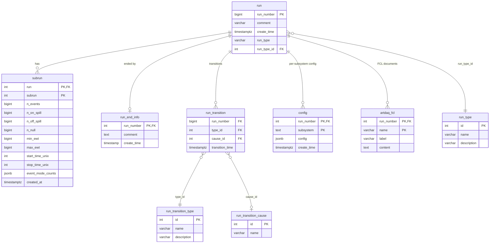
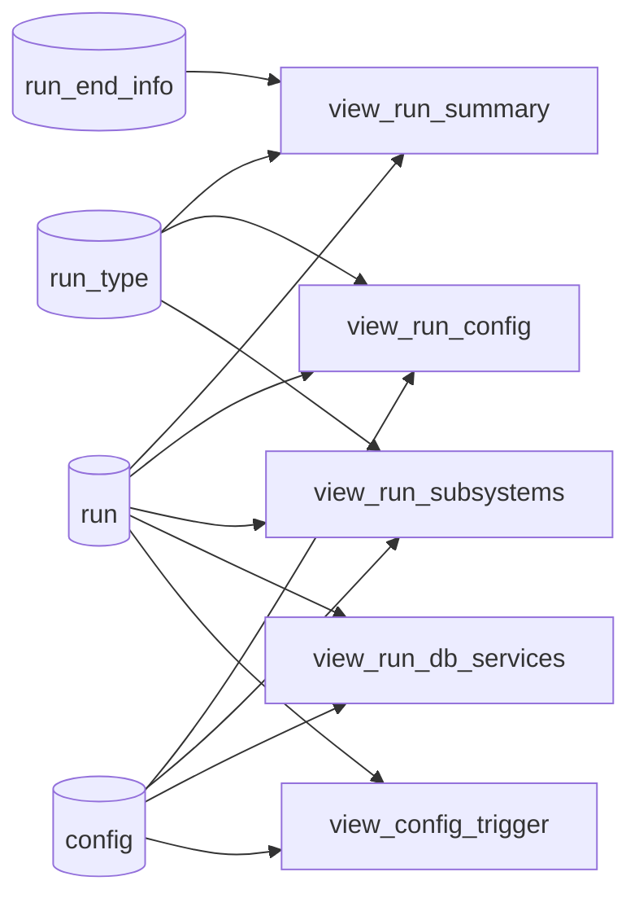

# mu2edaq-runlog-db — Schema Diagram

Derived from `db-schema.txt`. Foreign-key relationships are inferred from
column names and types (the source dump does not include constraint metadata),
so a few edges may need confirmation against the live database.

## Active core schema

## Derived views

Read-only views built on top of the core tables. They expose pre-joined
projections for UI/reporting and have no FK relationships of their own.

## Legacy / unused tables

These tables are marked `_notused` or `_old` in the dump and are not part of
the proposed organization. Kept here for reference during the migration.

| Table | Notes |
|---|---|
| `artdaq_components_notused` | Per-rank artdaq process inventory (host/port/label/subsystem). |
| `config_old` | Previous monolithic config table; superseded by `config`. |
| `config_subsystem_notused` | Old per-subsystem config alias / version metadata. |
| `config_subsystem_data_notused` | Old per-subsystem JSON payload split out of `config_subsystem_notused`. |
| `detector_setup_notused` | Lookup table referenced by `config_old.detector_setup_id`. |
| `run_summary_notused` | Earlier per-run summary blob; replaced by `view_run_summary`. |
